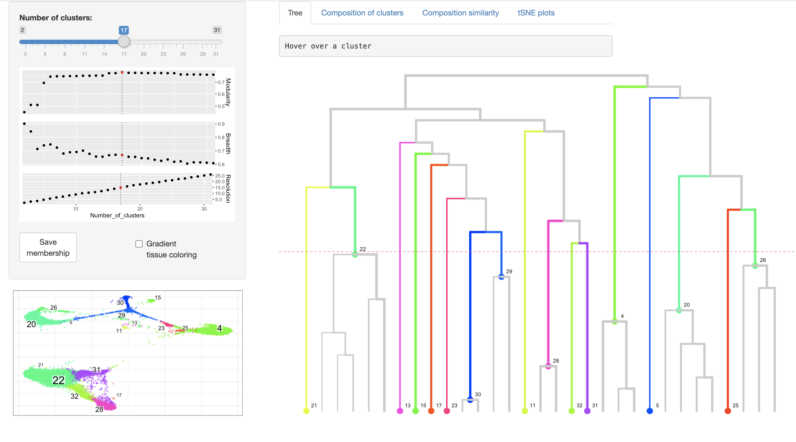

[](https://travis-ci.com/github/kharchenkolab/conosViz)


# conosViz

Shiny application to interactively visualize [conos](https://github.com/kharchenkolab/conos) results. Users can visualize dendrograms of the hierarchical community structure of clusters calculated from walktrap clustering. Interactive heatmaps allow users to explore the composition of clusters, similarity of the cluster compositions, and related tSNE plots.

## Installation

```r
devtools::install_github('kharchenkolab/conosViz')
```

## Usage

After creating a Conos object (please follow the walkthrough [here](https://github.com/kharchenkolab/conos/blob/master/doc/walkthrough.md)), simply use the function `conosShinyApp()`

**Note:** Before using the `conosViz`, users must first run `findCommunities(method=walktrap.communities)` to calculate walktrap clustering:

```
library(conos)
## create a Conos object `conos_object` using Conos$new(), then built a joint graph and cluster
library(conosViz)
conosShinyApp(con=conos_object)
```

<p align="center">
  
</p>


## Citation

If you find `conosViz` useful for your publication, please cite:

```
Viktor Petukhov and Evan Biederstedt (2020). conosViz: Shiny App to
Visualize Conos Dendrograms and Heatmaps. R package version 0.1.0.
https://github.com/kharchenkolab/conosViz
```
